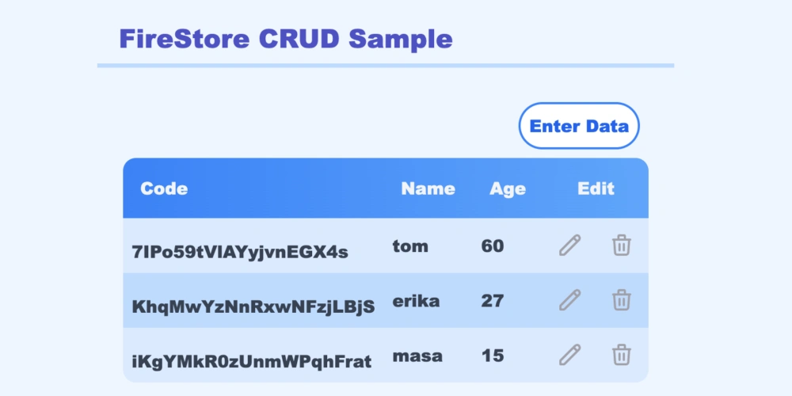
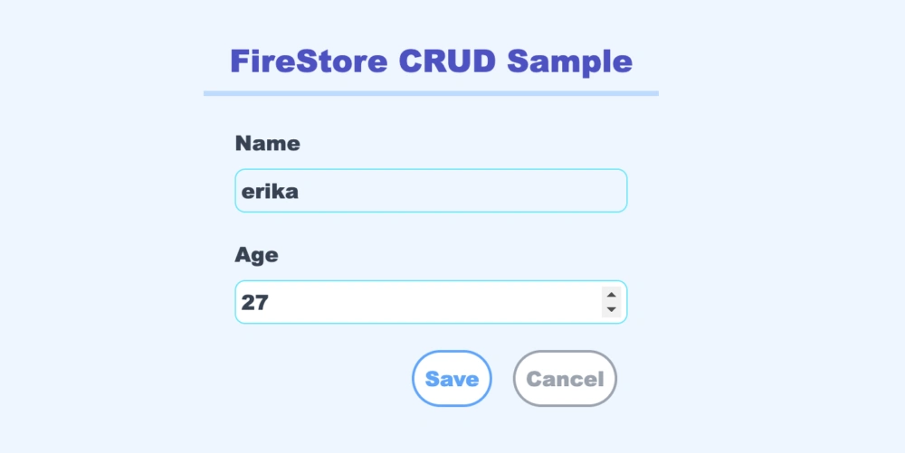

<h1 align="center">FireStore Version 9 CRUD SAMPLE </h1>

 🚀 React, NextJS, FireBase, TypeScript, Tailwindcss 

## **Summary**

 🔍 How to Use FireBase Version 9 in nextjs 

## Screen Example
#### Table (Edit Delete)

#### Input Form

## **Description**

<ul>
<li>🛠 Basic CRUD Technics for FireStore Version 9
<li>🛠 Data Convert Method in FireStore
<li>🛠 Custom Hook for FireStore and Form
<li>🛠 Simple Form Control
<li>🛠 TypeScript
<li>🛠 Tailwindcss
<li>🛠 You need to rename .env.local.sample to .env.local
<li>🛠 You need to configure env.local for your own firestore account information

</ul>

## **Author**
Yahsmassa ( Yasumasa Yabui)
